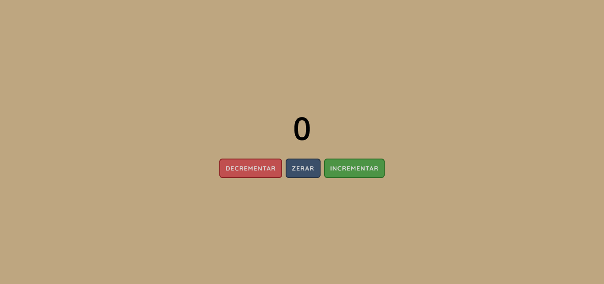

# Contador JS

Fiz esse contador simples em JS e CSS para testar meus conhecimentos.

## Table of contents

- [Overview](#overview)
  - [Screenshot](#screenshot)
  - [Links](#links)
  - [Built with](#built-with)

## Overview

### Screenshot

### Links

- Solution URL: [Repository](https://github.com/joaodiazz/contador_JS)
- Live Site URL: [GitHub Pages](https://joaodiazz.github.io/contador_JS/)

### Built with

- HTML DOM (JS)
- CSS Responsive
- Flexbox
